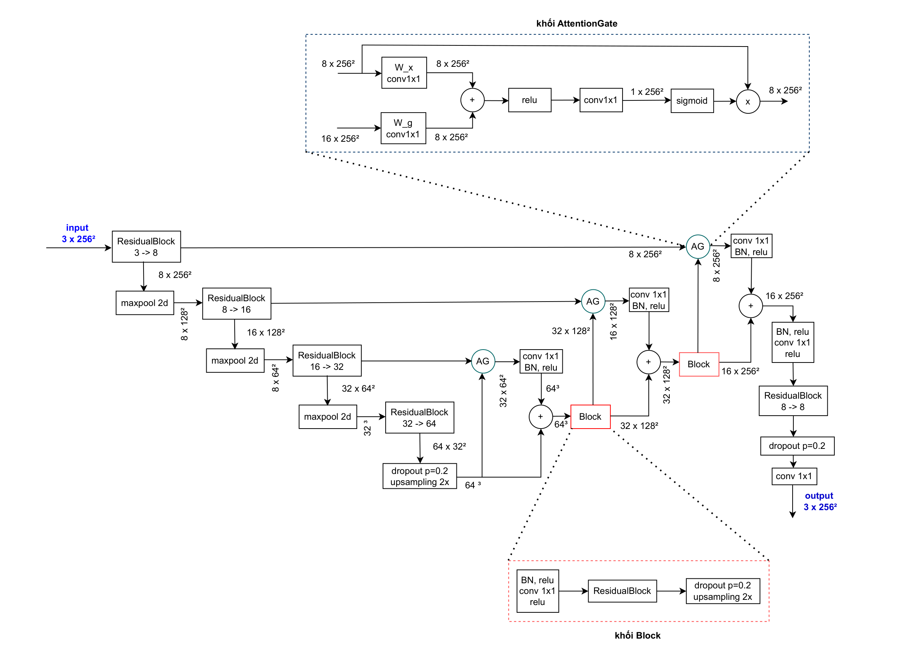
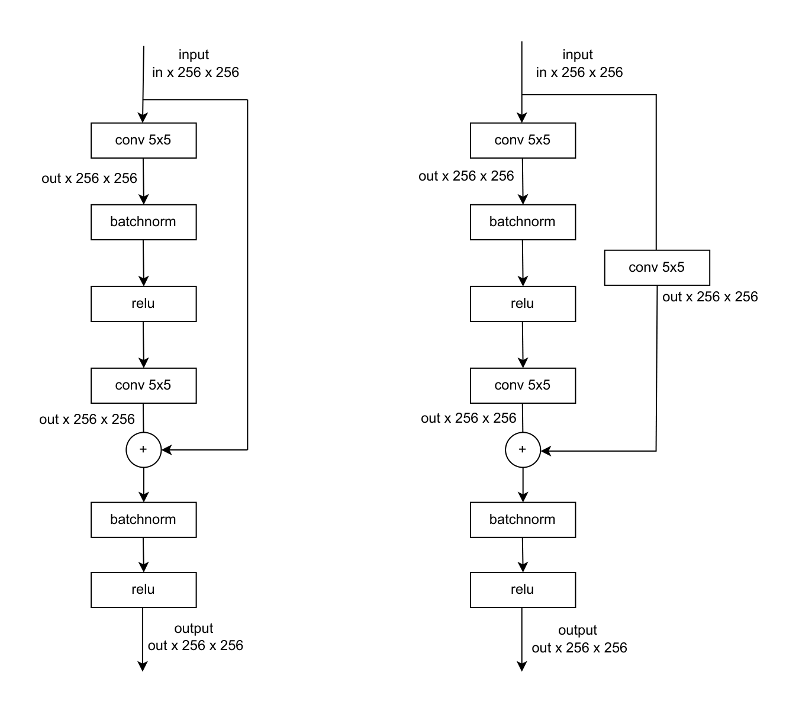
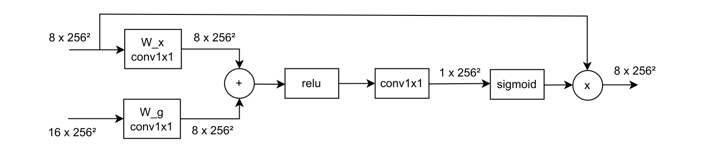
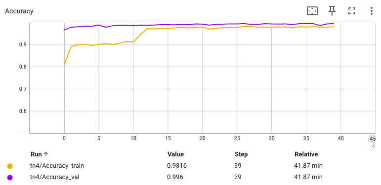
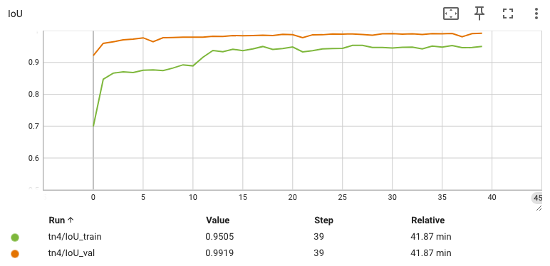
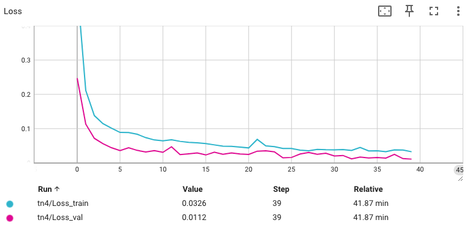
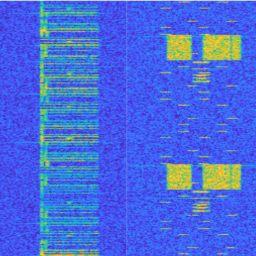
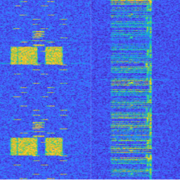
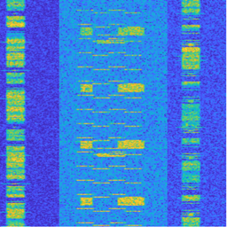
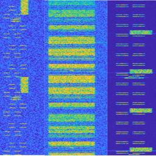

# 📡 Semantic Segmentation of 5G NR & LTE Spectrogram Signals

<p align="center">
  
</p>

A lightweight U-Net variant with **Residual Blocks**, **Channel Attention**, and **Dilated Convolutions** for pixel-level classification of 5G NR and LTE signals on spectrogram images. The model achieves **98.2% accuracy** and **95.1% mIoU** with only **~282K trainable parameters**.

---

## 📋 Table of Contents

- [Overview](#overview)
- [Model Architecture](#model-architecture)
- [Dataset](#dataset)
- [Results](#results)
- [Project Structure](#project-structure)
- [Usage](#usage)
- [References](#references)

---

## Overview

In modern wireless communications, efficient spectrum usage is critical. This project applies **semantic segmentation** to spectrogram images — 2D time-frequency representations of RF signals — to classify each pixel as belonging to **5G NR**, **LTE**, or **background/noise**.

### Key Contributions

- **Custom lightweight architecture** (`myModel`): A U-Net-inspired encoder-decoder with ResidualBlocks and Channel Attention, constrained to < 300K parameters
- **Spectrogram-based signal classification**: Converts 1D RF signal analysis into a 2D computer vision problem
- **High performance on limited compute**: Trained in ~42 minutes on a single GPU for 40 epochs

### Signal Characteristics

| Feature | 5G NR | LTE |
|---------|-------|-----|
| Bandwidth | Up to hundreds of MHz | 1.4–20 MHz |
| Structure | Flexible numerology, complex frame | Fixed Resource Blocks |
| Spectrogram Pattern | Wide, variable energy bands | Narrow, regular rectangular patterns |
| Modulation | High-order QAM, Massive MIMO | Simpler QAM variants |

---

## Model Architecture

The proposed `myModel` follows a **U-Net encoder-decoder** design enhanced with:

### Encoder (Contracting Path)
| Stage | Input Channels | Output Channels | Output Size |
|-------|---------------|-----------------|-------------|
| Encoder Block 1 (ResidualBlock) | 3 | 8 | 8 × 256 × 256 |
| MaxPool 2×2 | 8 | 8 | 8 × 128 × 128 |
| Encoder Block 2 (ResidualBlock) | 8 | 16 | 16 × 128 × 128 |
| MaxPool 2×2 | 16 | 16 | 16 × 64 × 64 |
| Encoder Block 3 (ResidualBlock) | 16 | 32 | 32 × 64 × 64 |
| MaxPool 2×2 | 32 | 32 | 32 × 32 × 32 |
| **Bottleneck** (ResidualBlock + Dilation) | 32 | 64 | 64 × 32 × 32 |
| Channel Attention + Dropout | 64 | 64 | 64 × 32 × 32 |

### Decoder (Expansive Path)
Each decoder stage performs: **Upsample → Concatenate with skip connection (Conv 1×1 + BN) → ResidualBlock → Dropout**

| Stage | Skip From | Output Channels | Output Size |
|-------|-----------|-----------------|-------------|
| Decoder Stage 3 | Encoder Block 3 | 32 | 32 × 64 × 64 |
| Decoder Stage 2 | Encoder Block 2 | 16 | 16 × 128 × 128 |
| Decoder Stage 1 | Encoder Block 1 | 8 | 8 × 256 × 256 |
| **Output** (Conv 1×1) | — | N_classes | N_classes × 256 × 256 |

### Building Blocks

<p align="center">
  
  &nbsp;&nbsp;&nbsp;
  
</p>
<p align="center"><em>Left: ResidualBlock with 5×5 convolutions and projection shortcut. Right: Channel Attention module.</em></p>

**Total trainable parameters: 282,326**

---

## Dataset

- **6,000+ spectrogram images**: ~3,000 LTE frames + ~3,000 5G NR frames
- **3-class pixel-wise labels**: Background (class 0), LTE signal (class 1), 5G NR signal (class 2)
- **Input resolution**: 256 × 256 × 3 (RGB)
- **Color-coded label masks**:
  - `(2, 0, 0)` → Background
  - `(127, 0, 0)` → LTE
  - `(248, 163, 191)` → 5G NR

---

## Results

### Training Curves (40 Epochs, ~42 minutes)

<p align="center">
  
  
  
</p>

### Final Metrics (Epoch 39)

| Metric | Train | Validation |
|--------|-------|------------|
| **Accuracy** | 0.9816 | **0.9960** |
| **Mean IoU** | 0.9505 | **0.9919** |
| **Loss** | 0.0326 | **0.0112** |

### Inference Samples

<p align="center">
  
  
  
  
</p>
<p align="center"><em>Input spectrogram images showing 5G NR and LTE signal patterns.</em></p>

---

## Project Structure

```
ImageSegmentation/
├── assets/                  # Architecture & training curve images
│   ├── model_architecture.png
│   ├── residual_block.png
│   ├── attention_block.png
│   ├── accuracy.png
│   ├── iou.png
│   └── loss.png
├── infer/                   # Inference results
├── checkpoints/             # Saved model weights
├── model_attention.py       # 🏗️ Model architecture (myModel)
├── dataset.py               # Dataset & data loading
├── learner.py               # Training loop & evaluation
├── main.py                  # Training entry point
├── inference.py             # Inference script
├── utils.py                 # Utilities (param counting, data split)
└── README.md
```

---

## Usage

### Training

```bash
python main.py
```

### Configuration (in `main.py`)

| Parameter | Value |
|-----------|-------|
| Optimizer | Adam (lr=0.001) |
| Loss | CrossEntropyLoss |
| Batch size | 32 |
| Epochs | 40 |
| Dropout | 0.2 |

### Inference

```bash
python inference.py
```

---

## Tech Stack

- **Framework**: PyTorch
- **Visualization**: TensorBoard
- **Data Processing**: OpenCV, NumPy
- **Training Platform**: CUDA GPU

---

## References

1. O. Ronneberger, P. Fischer, T. Brox, "U-Net: Convolutional Networks for Biomedical Image Segmentation," *MICCAI*, 2015.
2. K. He, X. Zhang, S. Ren, J. Sun, "Deep Residual Learning for Image Recognition," *CVPR*, 2016.
3. A. Vaswani et al., "Attention Is All You Need," *NeurIPS*, 2017.
4. L.-C. Chen et al., "Encoder-Decoder with Atrous Separable Convolution for Semantic Image Segmentation," *ECCV*, 2018.

---

## Author

**Duy-Vuong Tran** — Ho Chi Minh City University of Technology and Education (HCM-UTE)

[](https://github.com/vuongcris4)
[](https://scholar.google.com/citations?user=YSuKmTIAAAAJ)
